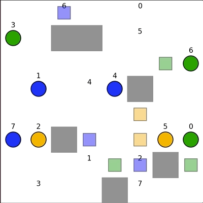

# Visual demonstration of solving Multi-Agent-Pathfinding (MAPF) problems

### What is happening
* Given several independent agents (in this case 7), the program will solve multi-agent pathfinding (MAPF) problem, and animate the solution path for each agent. 
* The solution to the MAPF problem found by the program is optimal (shortest paths for each agent and shortest running time possible) 
* **Inspiration**: Amazon warehouse AI robots: https://www.youtube.com/watch?v=HSA5Bq-1fU4  @ 33 seconds in

### Running the demo
Run the program like so:

```python
python3 run_experiments.py --instance instances/<test_case.txt> --solver <algorithm>
```

E.g, The above animation can be run by using
```python
python3 run_experiments.py --instance instances/test_21.txt --solver CBS
```

### different MAPF algorithms
* each of the following MAPF algorithms use A-Star search (heuristic based search) under the hood
 
#### Independent algorithm
* plans for all the agents independently. Their paths do not collide with the environment, but are allowed to collide with the paths of other agents. Therefore, collisions are allowed

#### Prioritized algorithm
* orders the agents by assigning each agent a different priority. It then plans paths for the agents, one after the other, in order of decreasing priority. 
* Prioritized planning is fast but suboptimal (meaning that it does not always find an optimal collision-free solution) and incomplete (meaning that it does not always find a collision-free solution even if one exists) 
 
#### CBS algorithm
* plans the shortest paths for all the agents independently. If theres a collision between agents, it recursively considers two cases:
1. the (negative) constraint that prohibits agent a from being in cell x at time step t 
2. the (negative) constraint that prohibits agent b from being in cell x at time step t. 
* Eventually, CBS finds a collision-free solution that is complete and optimal
